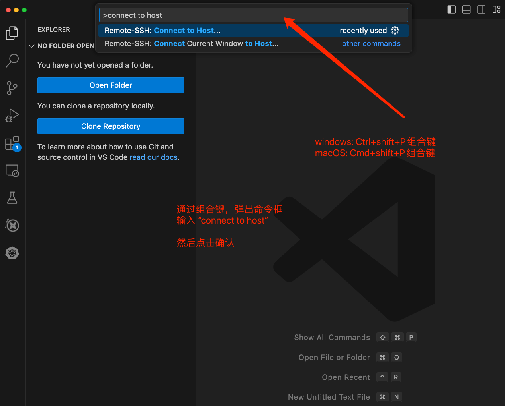
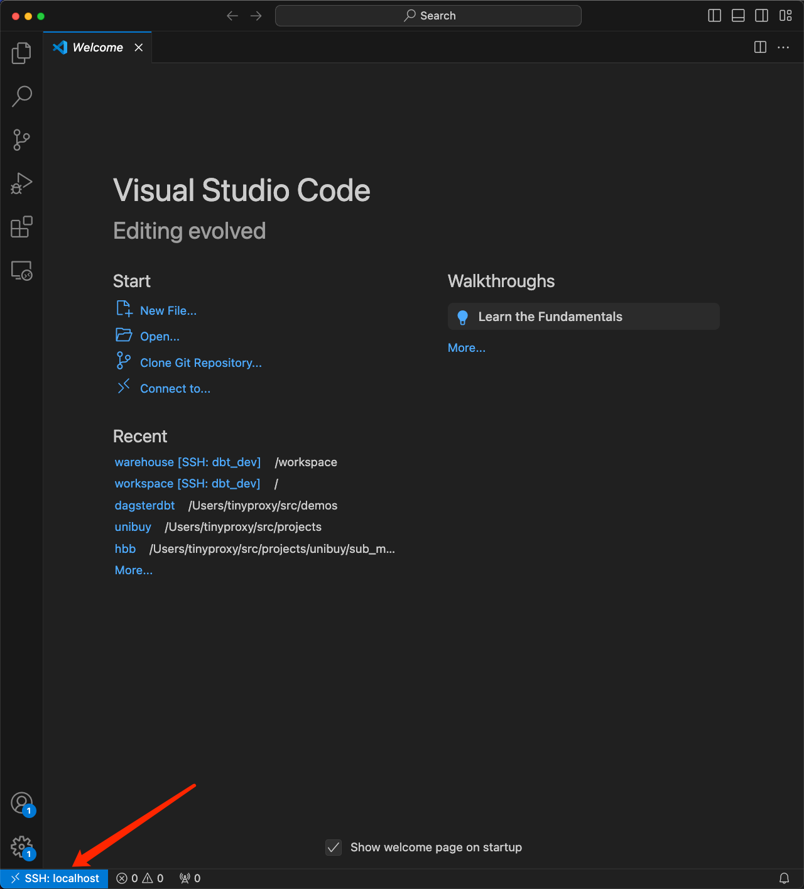
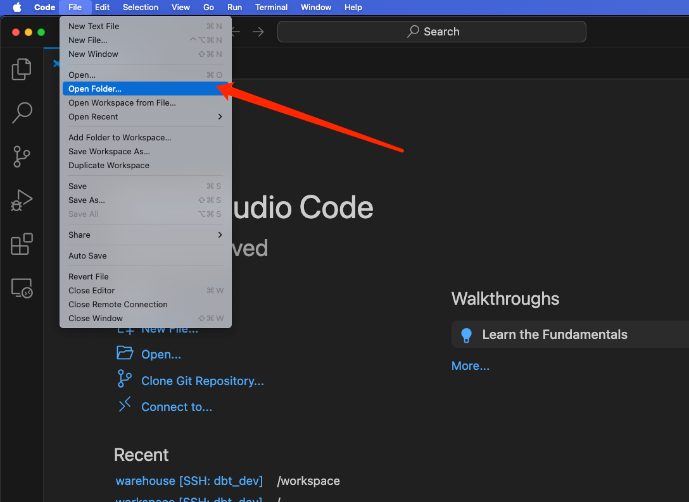
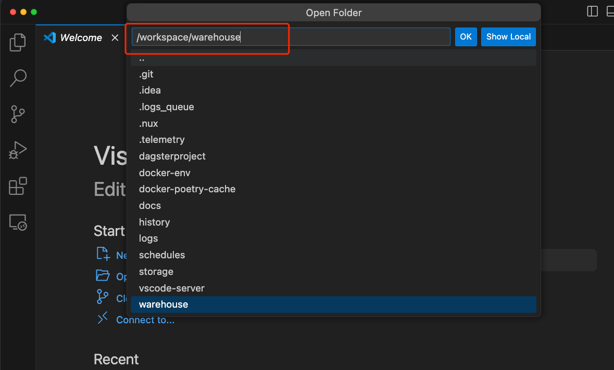
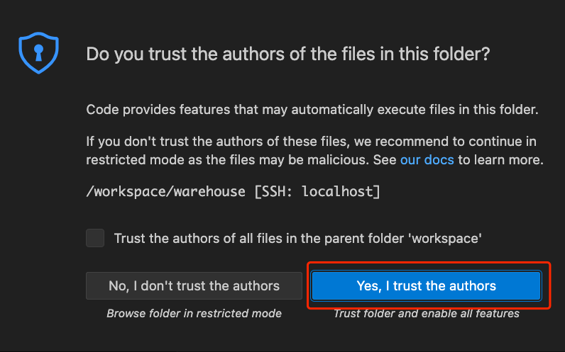
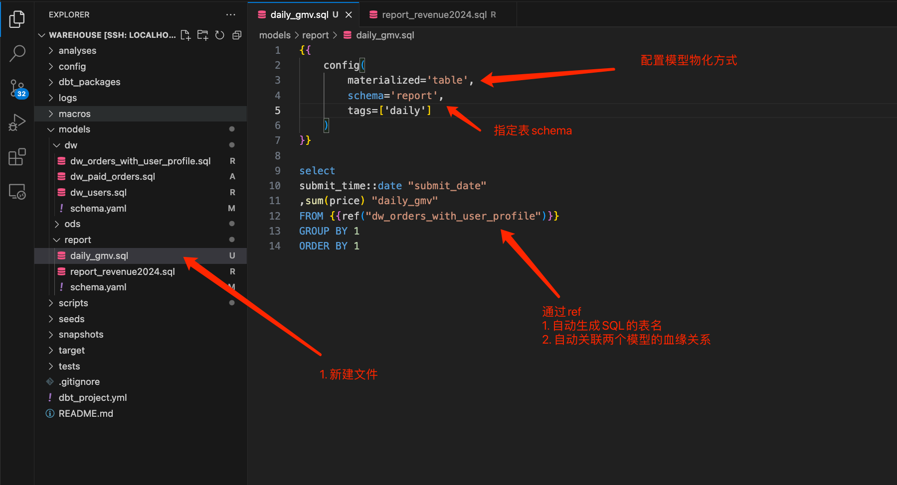
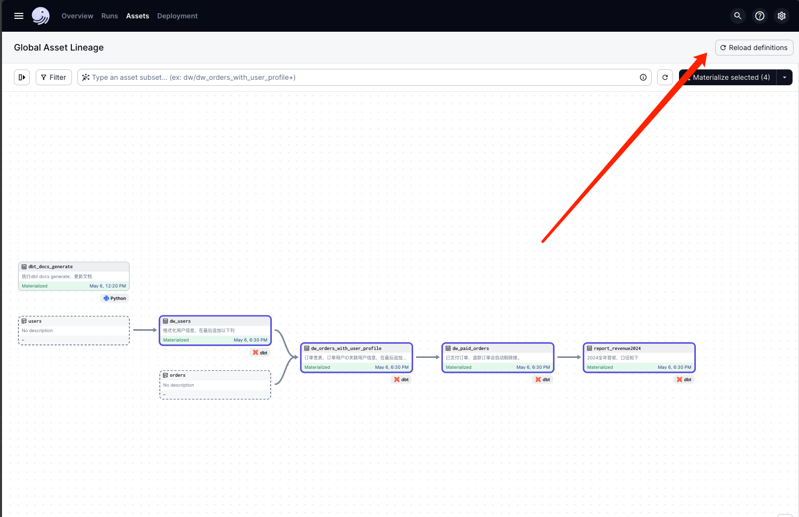
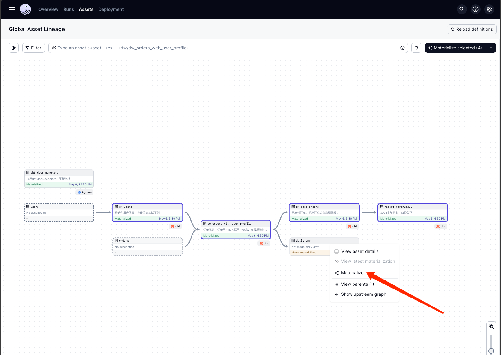

# README DEV

1. **该文档专为开发人员设计，请根据具体技术需求进行参考和应用。**
2. 配置事项检查表
   - 环境初始化
      - [ ] 配置PG兼容数据库服务；
      - [ ] 执行数据初始化脚本；
      - [ ] 下载安装docker；
      - [ ] 使用docker构建开发环境；
      - [ ] 初始化dbt profile文件
   - vscode初始化配置
     - [ ] 下载vscode；
     - [ ] 安装remote ssh插件；
     - [ ] 添加ssh host，指向container；
     - [ ] 打开远程目录`/workspace/warehouse`
   - 开发新dbt模型
     - [ ] 创建新模型文件
     - [ ] 在dagster点击"Reload definitions"
     - [ ] 在dagster右键点击新模型，并执行物化；


## 环境初始化
1. 启动PG或PG兼容数据库服务（例如ProtonBase），创建一个新的数据库`demo_warehouse`
    - 数据初始化参考脚本`warehouse/scripts/ods_init.sql`
2. 基于docker，构建开发环境；
3. 配置dbt profile文件；


### 基于docker，构建开发环境
1. 安装docker最新版本；
2. 执行`cd docker-env;docker build -t dagsterdbt:latest ./`
3. docker container端口说明
    - 23000/TCP，便于在外部进行访问`dagster-webserver`；
    - 28000/TCP，便于在外部访问`dbt docs`；
    - 20022/TCP，便于vscode使用ssh进行远程访问；
4. docker 挂载目录说明
    - `/workspace`，挂载项目代码；
    - `/root/.cache/pypoetry`，缓存poetry安装文件，加速后续启动速度；
    - `/root/.vscode-server/`，缓存vscode server文件，加速后续启动速度；

### 配置dbt profile
1. 使用编辑器，打开文件文件`warehouse/config/profiles.yml`，参考以下模板。

```yaml
warehouse:
  outputs:
    dev: # 测试环境配置
      dbname: demo_warehouse
      host: '$PG_HOST' # IP地址
      pass: '$PG_PASSWORD'
      port: 5432       # 默认端口5432
      threads: 1       # 数据库连接并发度
      schema: 'public'
      type: postgres
      user: PG_USERNAME
    uat: {}        # UAT环境配置，key/value参考dev
    production: {} # 生产环境配置，key/value参考dev
  target: dev # 默认把dbt模型物化到dev环境
```

### vscode
1. 从官网下载vscode：https://code.visualstudio.com/download
2. 安装remote-ssh插件: https://marketplace.visualstudio.com/items?itemName=ms-vscode-remote.remote-ssh
   - 点击后在网页上选择安装，会自动跳转vscode，根据提示继续安装插件；

## 开发dbt模型
1. 启动开发环境，执行命令`docker-run.sh`
   - 将脚本变量`SSH_PUBLIC_KEY`替换为自己的ssh公钥；
2. 浏览器访问`http://localhost:23000/locations` ，观察模块是否正常加载;
3. 使用vscode启动远程ssh访问，参考截图
4. 第一次启动配置
   - 请选择“添加新SSH站点”（"Add New SSH Host"）
   - 复制以下命令 `ssh root@localhost -p20022`（如果ssh私钥不在~/.ssh/id_rsa，请指定相关路径）
5. 重复操作3，选择`localhost`并继续，连接成功则左下角状态栏如截图
6. 点击菜单栏，选择"文件-->打开目录"
7. 输入dbt目录`/workspace/warehouse`，并点击确认
8. 点击选择信任目录文件

9. 新建一个模型`daily_gmv`，并保存文件
```sql
{{
    config(
        materialized='table',
        schema='report',
        tags=['daily']
    )
}}

select
submit_time::date "submit_date"
,sum(price) "daily_gmv"
FROM {{ref("dw_orders_with_user_profile")}}
GROUP BY 1
ORDER BY 1
```

10. 访问dagster资产列表，点击`Reload definitions`重新加载dbt模型

11. 点击物化新增dbt模型
