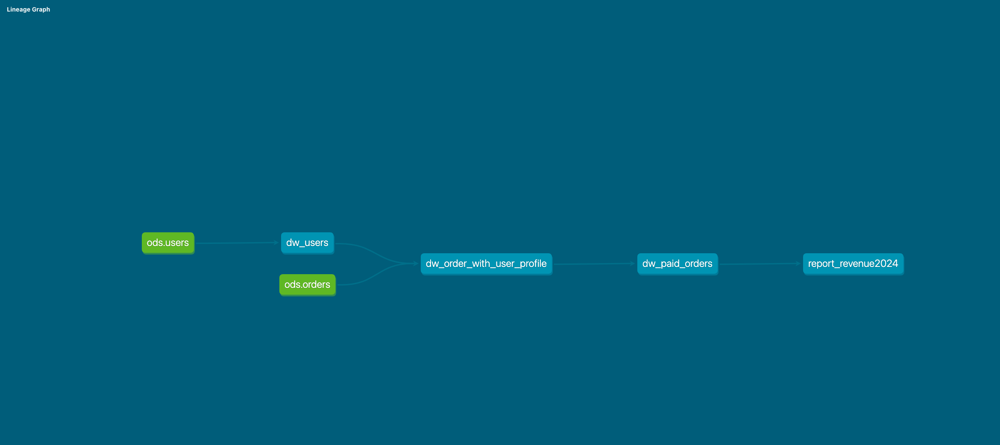
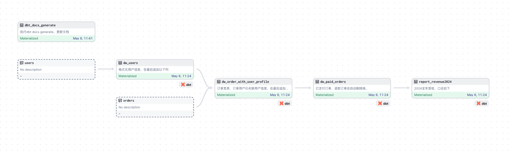
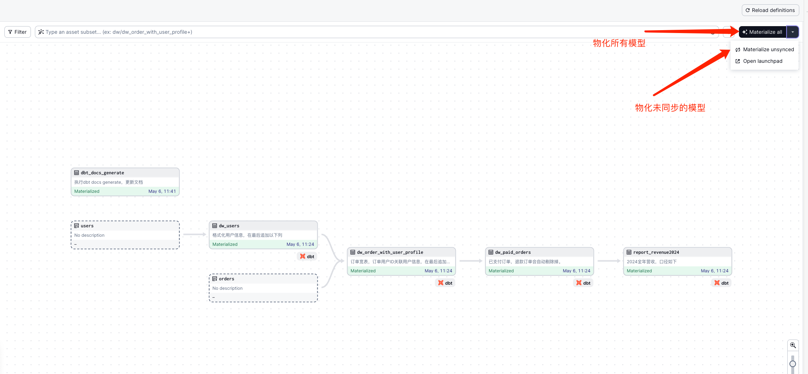
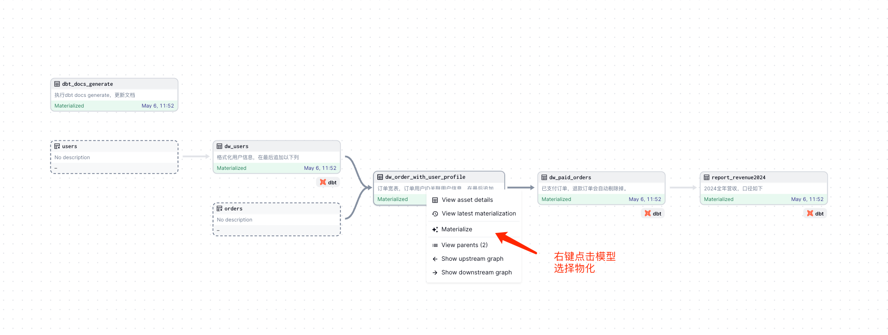
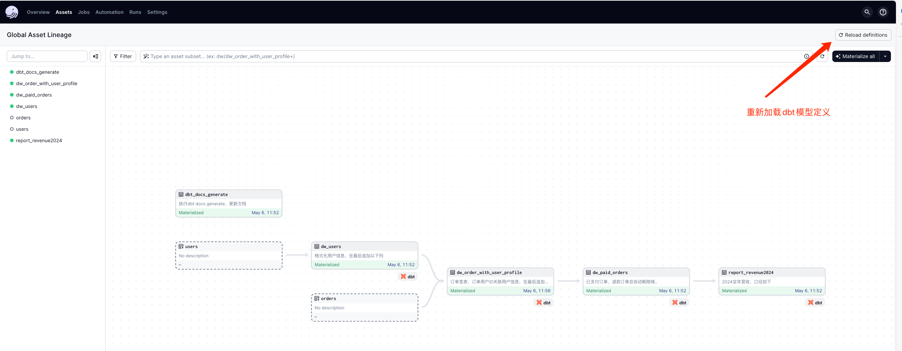
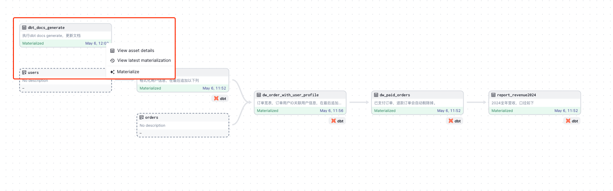

# dagster-dbt demo

## 组件介绍
1. Dagster是一个数据工程框架，旨在帮助您管理数据流程的整个生命周期。它可以让您定义、调度和监控数据管道，同时提供了丰富的工具和功能，用于确保数据的可靠性、可重现性和可维护性。
2. DBT是一种数据建模工具，用于将原始数据转换为可查询的、易于理解的数据集。它通过模板化、重用和版本控制等功能，帮助您管理数据转换过程，从而提高数据团队的生产力和数据产品的质量。
3. 将这两个工具结合起来使用，可以带来以下好处
    - 清晰的责任划分：Dagster负责管理整个数据流程的调度和监控，而dbt则专注于数据转换和建模。这样一来，每个工具都可以专注于自己的核心功能，提高了系统的可维护性和可扩展性；
    - 可重用的组件：您可以在Dagster中定义dbt作业，并将它们作为可重用的组件在不同的数据管道中调用。这种模块化的设计使得数据工程团队能够更加高效地开发和管理数据管道；
    - 更好的可观察性：Dagster提供了丰富的监控和日志功能，可以帮助您实时追踪数据流程的执行情况。通过与dbt集成，您可以更加全面地监控数据转换过程，及时发现和解决潜在的问题；


## DBT演示内容
### ODS数据集
####  用户表users
1. 用户表存储了所有注册用户的基本信息，包括用户ID、用户名、注册时间、用户级别等重要信息。

| column    | data type   | description |
|-----------|-------------|-------------|
| id        | bigint      | 用户ID |
| firstname | varchar(64) | |
| lastname  | varchar(64) | |
| phone_ciphertext | varchar(64) | 电话密文 |
| email_ciphertext | varchar(128) | 邮件密文 |
| signup_time | timestamp with time zone | 注册时间 |
| gender | boolean | 性别，0/1 ==> 女/男 |
| birthday | date | 出生日期 | 

#### 订单表orders
1. 订单表存储了所有的订单信息，包括订单编号、用户ID、订单金额、下单时间等关键信息。

| column    | data type       | description |
|-----------|-----------------|-------------|
| id | bigint          | 订单ID |
| user_id | bigint          | 订单用户ID |
| goods_snapshot | jsonb           | 订单商品快照信息 |
| price | numeric(18, 2)  | 订单价格 |
| coupon | numeric(18, 2)  | 补贴价格 |
| status | smallint | 订单状态， 0未付款/1已付款/2已发货/3已签收/4确认收货/5退款 |
| submit_time | timestamp with time zone | 订单提交时间 |
| pay_time | timestamp with time zone | 订单支付时间 |

### DW层建模
#### 1. `dw_users`，用户信息格式化，添加年龄等信息。

```sql
SELECT
users.*
,DATE_PART('year', AGE(NOW(), birthday::timestamp)) AS "age"
FROM "demo_warehouse"."ods"."users" users
```

#### 2. `dw_order_with_user_profile`，订单用户信息宽表，便于后续数据分析。
```sql
SELECT
orders.*
,users.gender "user_gender"
,users."age" "user_age"
,DATE_PART('year', AGE(orders.submit_time, users.birthday::timestamp)) "user_submit_age"
FROM "demo_warehouse"."ods"."orders" orders
LEFT JOIN "demo_warehouse"."dw"."dw_users" users
ON orders.user_id = users.id
```

#### 3. `dw_paid_orders`， 已付款的订单宽表。
```sql
SELECT * FROM "demo_warehouse"."dw"."dw_order_with_user_profile"
WHERE
status BETWEEN 1 AND 4
```

### 报表建模
#### 1. `report_revenue2024`，2024年全年营收。

```sql
SELECT
SUM(price - coupon)
FROM "demo_warehouse"."dw"."dw_paid_orders"
WHERE submit_time BETWEEN '2024-01-01 00:00:00' AND '2024-12-31 23:59:59'
```

### 血缘图



## dagster演示内容
### dagster Definitions
1. 参考文件`dagsterproject/__init__.py`。

### global lineage



### 物化模型
1. `Materialize all`，物化所有dbt模型，效果等同`dbt build`
2. `Materialize unsynced`，物化**未同步**的dbt模型，效果等同`dbt build --select $UNSYNC_MODELS`


### 物化特定模型


### 同步DBT模型
1. 同步DBT的模型列表（改名、新增、删除等情况）；



### 重新生成文档


